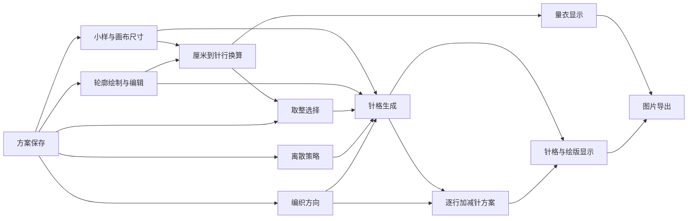

# 产品总览

> 状态：部分确认。最终目标和跨设备要求有明确项目依据；目标用户细分、编织业务规则和多数具体行为仍待确认。

## 一、产品最终目标

**已确认：**这是一个用于绘制、分析毛衣编织图解尺寸及加减针规律的网页工具。用户提供形状后，产品最终应把形状转换成可用于实际毛衣编织的图解，并给出合理、可执行的尺寸、针格及加减针方案。

当前实现只是探索中的方案，不能作为正确产品设计的自动依据。可靠依据及效力记录见[产品决策记录](./产品决策记录.md)。

## 二、目标用户

**待确认：**从产品目标推测，使用者需要理解编织小样、针数、行数和加减针表达；但尚不能确认主要面向个人编织者、服装设计师、打版师、教学者，还是不同经验层级的混合用户。这个答案会影响术语解释、默认规则、错误提示和图解详细程度。

## 三、主要解决的问题

- 把真实厘米尺寸与用户自己的编织密度联系起来。
- 让用户用轮廓表达织片形状，并把连续曲线转换为离散针格。
- 从相邻编织行的边界变化推导加针、减针、平收、领口分片等说明。
- 让尺寸误差、针格结果和编织步骤在同一画布中可检查。
- 保存多个本地方案，并通过方案文件或图片带走结果。

除上述目标外，各问题当前是否已经被正确解决仍需按功能文档判断。

## 四、完整用户使用流程

1. 打开产品，进入当前本地方案；首次进入会得到一份空白方案。
2. 输入编织小样的针数、行数、宽度和高度，并设置画布厘米尺寸。
3. 查看系统换算出的单针、单行尺寸和画布总针数、总行数；处理异常或超限输入。
4. 使用路径工具描出轮廓，可完成开放路径或闭合路径；也可从旧存档或导入文件取得其他几何图形。
5. 选择轮廓，调整位置、宽高、节点、控制柄、曲线、开闭状态或左右镜像状态。
6. 在“量衣”模式查看各边界段的厘米到针数/行数换算；非整数结果选择向下或向上取整。
7. 在“针格”或“绘版”模式检查离散结果、编织方向和分段加减针标注；按需要切换自下而上或自上而下。
8. 通过平移、缩放、适应画布和可移动标注检查细节，必要时撤销或重做。
9. 自动保存当前方案；可新建、切换、重命名、删除、导入或导出方案。
10. 按当前显示模式导出 PNG 图片，用于查看或沟通。

以上流程为**根据现状整理**，并不等同于已确认的理想流程。

## 五、主要产品概念

| 概念 | 产品层含义 | 当前确认状态 |
|---|---|---|
| 小样 | 一块已知针数、行数与厘米尺寸的编织样片 | 根据现状整理；测量口径待确认 |
| 编织密度 | 每厘米针数、每厘米行数，以及单针和单行的厘米尺寸 | 根据现状整理 |
| 画布 | 以厘米定义的可计算区域，原点显示在左下角 | 根据现状整理 |
| 轮廓对象 | 一个可编辑的几何对象；闭合对象当前被当作织片 | 根据现状整理 |
| 边界段 | 相邻锚点之间的一段直线或曲线，用于尺寸和编织标注 | 根据现状整理 |
| 针格 | 由一针宽和一行高组成的离散单元 | 根据现状整理 |
| 离散策略 | 决定轮廓覆盖哪些针格的三种选择 | 根据现状整理 |
| 编织方向 | 对单个织片选择自下而上或自上而下 | 根据现状整理 |
| 取整策略 | 对非整数针数或行数选择向下或向上 | 根据现状整理 |
| 方案 | 一组密度、画布、轮廓、方向、取整、离散和显示状态 | 根据现状整理 |

## 六、主要功能关系

## 七、核心数据及其关系

- 小样源数据：小样针数、小样行数、小样宽度、小样高度。
- 画布源数据：宽度和高度，单位均为厘米。
- 轮廓源数据：类型、名称、位置、锚点、控制柄、开闭状态和可选镜像中心轴。
- 每对象规则：编织方向、横向取整选择、纵向取整选择。
- 全方案规则：离散策略和当前显示模式。
- 派生结果：编织密度、画布针格规模、每对象针格、合并针格、分段尺寸、逐行指令和标注文案。
- 本地方案信息：名称、创建时间、更新时间和完整编辑文档。

上游源数据发生变化时，派生结果应重新计算而不是作为权威结果单独保存。具体保存范围见[方案保存与文件交换](./功能说明/方案保存与文件交换.md)。

## 八、全局编织原则

**已确认：**最终图解必须合理、可执行，尺寸与针数换算准确，加减针规律适合实际编织，并便于用户理解和使用。

**待确认：**当前项目没有足够依据定义下列业务规则：平面编织还是圈织、正反面行限制、具体加减针技法、缝份与松量、花样倍数、罗纹倍数、对称配针、纱线与洗后密度、肩部和领口工艺。任何算法通过测试都不代表已经满足这些实际编织规则。

## 九、全局尺寸和单位原则

- **根据现状整理：**核心源数据使用厘米、针和行；显示像素只负责画布呈现。
- **根据现状整理：**画布坐标原点在左下角，横向为厘米宽度，纵向为厘米高度。
- **根据现状整理：**画布总针数和总行数按最接近整数计算；织片非整数尺寸使用另一套需要用户选择向上或向下的流程。
- **待确认：**厘米显示保留至两位小数是否足够，输入与内部计算需要何种精度，以及画布取整与织片取整是否应该统一。

尺寸换算和取整的唯一规则归属为[尺寸换算与取整确认](./功能说明/尺寸换算与取整确认.md)。

## 十、全局交互原则

- **已确认：**核心流程不能依赖悬停、右键或键盘快捷键作为唯一入口。
- **已确认：**绘制、选择、拖动、缩放、编辑、确认和撤销必须有 Apple Pencil 或触控可完成的路径。
- **根据现状整理：**页面提供工具栏、左侧参数区和主画布；画布主要使用指针事件。
- **根据现状整理：**当前仍有双击插点、键盘删节点、回车完成和 Alt 临时关闭方向吸附等鼠标/键盘行为；部分已有按钮替代，部分没有。

## 十一、iPad、Apple Pencil 和触控要求

- **已确认：**iPad 横屏和竖屏都属于必须支持的使用环境。
- **已确认：**Apple Pencil、触控和鼠标均应能完成核心操作，并有清晰反馈和足够大的触控目标。
- **根据现状整理：**在 1024×768 和 768×1024 浏览器视口下页面没有产生整页横向溢出；侧栏保持 250 像素宽，工具栏出现横向滚动。
- **根据现状整理：**768 像素宽的竖屏仍使用左右栏布局，工具栏内容宽约为可见区的两倍，后部操作需要横向滚动。
- **风险：**当前单指触控被固定用于平移，触控点击被忽略；轮廓手柄半径约 4～6 像素，节点删除依赖键盘。真实 Apple Pencil、手掌防误触、断笔和 Safari 文件操作均未验证。

## 十二、产品当前阶段已知限制

- 当前页面只能新建路径；其他几何图形只有底层能力，可能通过旧存档或导入出现。
- 加减针归纳每行最多支持两个分离针段；三段以上会标记为不支持，但当前页面缺少明确全局警告。
- 当前规则只比较相邻行的针段边界，没有完整的实际针法、正反面行或花样倍数约束。
- 多对象在总针格中取并集，但每个对象独立生成编织计划；这一产品含义尚未确认。
- 开放路径的用途在 README、底层计算和编辑器显示之间不一致。
- 标注拖动位置、缩放、平移、当前工具和未完成草稿不随方案保存。
- 方案仅保存在当前浏览器本地；没有账户、云同步或协作。
- PNG 是当前视图的视觉导出，不是结构化逐行编织文件。

## 十三、现状依据范围

本次梳理读取了根目录规则、README、全部页面和组件、状态与持久化模块、几何/密度/针格/编织计算模块，以及现有自动化测试；并在本地页面检查了桌面默认入口、1024×768 横屏和 768×1024 竖屏布局。没有使用真实编织样片验证，也没有真实 iPad 或 Apple Pencil 设备验收。

## 十四、全局正确结果

**部分确认：**最终正确结果必须能从用户给定轮廓和密度得到尺寸明确、针行数准确、加减针可执行且易读的编织图解。

**待确认：**在业务规则未确认前，当前针格和加减针算法只能视为候选实现，不能作为实际制作毛衣的已验证依据。

## 十五、全局待确认问题

1. 目标用户是谁、默认拥有何种编织知识？影响术语、引导、错误提示和图解详细度。
2. 输入轮廓表示人体测量、成衣成品尺寸还是实际织片尺寸？是否已经包含松量、缩率和缝份？影响所有尺寸与针格。
3. 产品要支持平面往返编织、圈织，还是两者；前后片、袖片等是否有不同规则？影响行号、边界和加减针说明。
4. 针数与行数是否必须满足花样倍数、罗纹倍数、中心对称和边针？影响取整和起针数。
5. 对称外观与对称针数冲突时优先哪一个？影响镜像轮廓、取整和领口/肩部结果。
6. 用户需要的是逐行指令、压缩规律、针法图符，还是三者组合？影响最终输出结构和图片导出。
7. 多个轮廓对象的业务含义是什么？影响合并针格和独立计划是否正确。
8. 是否接受“触控只导航、Apple Pencil 绘制”的设备分工？这与当前“触控完整等价”规则存在潜在冲突，必须由用户明确决定。
