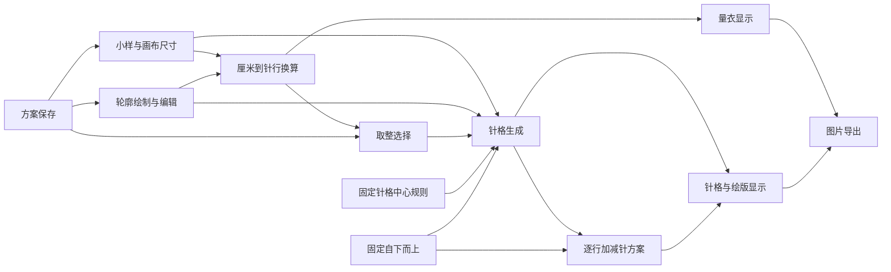

# 产品总览

> 状态：部分确认。最终目标和跨设备要求有明确项目依据；目标用户细分、编织业务规则和多数具体行为仍待确认。

## 一、产品最终目标

**已确认：**这是一个用于绘制、分析毛衣编织图解尺寸及加减针规律的网页工具。用户提供形状后，产品最终应把形状转换成可用于实际毛衣编织的图解，并给出合理、可执行的尺寸、针格及加减针方案。

当前实现只是探索中的方案，不能作为正确产品设计的自动依据。可靠依据及效力记录见[产品决策记录](./产品决策记录.md)。

## 二、目标用户

**部分确认：**主要使用场景是编织机分片编织，用户一般不手工棒针编织；因此计算、术语和操作步骤应优先服务于机织及后整理连接。编织机品牌和型号不是核心换算的必填信息。当前默认面向有基础编织机经验的用户：可以直接使用常见机织术语，但关键输入、风险和结果需要提供简短解释，不采用完整新手教程，也不假设用户具备专业打版经验。后续考虑增加可切换的专业定位，以提供更紧凑、解释更少的操作界面。是否还面向服装设计师、打版师、教学者或手织用户仍待确认。

## 三、主要解决的问题

- 把真实厘米尺寸与用户自己的编织密度联系起来。
- 让用户用轮廓表达织片形状，并把连续曲线转换为离散针格。
- 从相邻编织行的边界变化推导权威逐行操作表，并提供加针、减针、平收和中间分段等压缩摘要；未标记服装部位时不自动把分段命名为领口或肩部。
- 让尺寸误差、针格结果和编织步骤在同一画布中可检查。
- 保存多个本地方案，并通过方案文件或图片带走结果。

除上述目标外，各问题当前是否已经被正确解决仍需按功能文档判断。

## 四、完整用户使用流程

1. 打开产品，进入当前本地方案；首次进入会得到一份空白方案。
2. 输入编织小样的针数、行数、宽度和高度，并设置画布厘米尺寸。
3. 查看系统换算出的单针、单行尺寸和画布总针数、总行数；处理异常或超限输入。
4. 使用路径工具分别描出后片、左前片、右前片等独立织片的成衣外观轮廓；已完成的开放路径可保存并继续编辑或连接，只有闭合轮廓才进入编织计算。也可从旧存档或导入文件取得其他几何图形。
5. 选择轮廓，调整位置、宽高、节点、控制柄、曲线、开闭状态或左右镜像状态。
6. 在“量衣”模式查看各边界段的厘米到针数/行数换算；非整数结果默认采用厘米误差最小的最近整数，也可改为向下或向上。
7. 在“针格”或“绘版”模式检查按固定针格中心规则生成的结果和自下而上的逐行操作表，并用分段加减针摘要快速浏览。
8. 通过平移、缩放、适应画布和可移动标注检查细节，必要时撤销或重做。
9. 自动保存当前方案；可新建、切换、重命名、删除、导入或导出方案。
10. 按当前显示模式导出 PNG 图片，用于查看或沟通。

以上流程为**根据现状整理**，并不等同于已确认的理想流程。

## 五、主要产品概念

| 概念 | 产品层含义 | 当前确认状态 |
|---|---|---|
| 小样 | 使用与成衣相同的纱线、组织和张力编织，完成相同洗涤和定型后测量中间区域的样片 | 已确认；当前界面尚未提示完整测量口径 |
| 编织密度 | 从排除边针的小样中间区域计算每厘米针数、每厘米行数，以及单针和单行的厘米尺寸 | 测量口径已确认；当前使用主体平针密度，后续支持多密度分区 |
| 密度分区 | 织片中使用主体平针、罗纹或花纹等不同密度的区域 | 后续需要支持；分区方式和跨区衔接待确认 |
| 画布 | 以厘米定义的可计算区域，原点显示在左下角 | 根据现状整理 |
| 轮廓对象 | 用户测量并绘制的一片独立织片对应的成衣外观边界，不含额外缝合余量；取整和对称针格不得改写它 | 已确认；当前代码尚未把它转换为含缝合余量的织片边界 |
| 织片计算边界 | 常规缝合边每片增加一针边针；平收后手工缝合的肩边每片默认增加一行并可改为零行；开放边不增加 | 已确认；边类型由系统推荐、用户可逐边修改，无法判断时必须确认；当前代码尚未实现 |
| 边界段 | 相邻锚点之间的一段直线或曲线，用于尺寸和编织标注 | 根据现状整理 |
| 针格 | 由一针宽和一行高组成的离散单元 | 根据现状整理 |
| 针格中心离散 | 在行中心高度读取轮廓范围，针格中心落在范围内时计入 | 已确认当前固定使用；当前代码仍提供三种策略 |
| 编织方向 | 当前固定为自下而上；自上而下留待未来单独设计 | 已确认；当前代码仍提供两个方向 |
| 取整策略 | 当前平针阶段，小数针行数默认采用厘米误差最小的最近整数，恰好半针/半行时向上，并允许用户改为向上或向下 | 已确认；镜像与缝合补偿共同参与计算，当前代码尚未自动推荐 |
| 方案 | 一组密度、画布、轮廓、方向、取整、离散和显示状态 | 根据现状整理 |

## 六、主要功能关系

## 七、核心数据及其关系

- 小样源数据：完成与成衣相同后整理后，在排除边针的中间区域测得的小样针数、行数、宽度和高度；小样应使用与成衣相同的纱线、组织和张力。当前阶段保存一套主体平针密度，后续需要保存多套密度档案。
- 待补充的密度分区数据：织片内各区域使用哪套密度，以及不同密度区域之间的针数与行数衔接规则。
- 画布源数据：宽度和高度，单位均为厘米。
- 轮廓源数据：用户测量的成衣外观尺寸，包括类型、名称、位置、锚点、控制柄、开闭状态和可选镜像中心轴；不含额外缝合余量。
- 开放路径规则：已完成的开放路径作为未闭合轮廓源数据保存，可继续编辑或连接；闭合前不参与尺寸取整、针格、编织计划或正式导出。正在绘制且未完成的临时草稿不保存。
- 待补充的缝合规则数据：每条边的系统推荐类型、用户最终确认类型及可选覆盖值。侧缝、袖缝和袖窿等常规缝合边默认每片增加一针边针；平收后手工缝合的肩边每片默认增加一行并允许改为零行；领口、下摆和袖口等开放边不增加。系统无法可靠判断边类型时必须要求用户确认。
- 核心换算不读取编织机品牌或型号；未来可选的机器能力信息只用于针床宽度、可用动作和兼容性检查。
- 每对象规则：系统推荐的最小误差取整结果，以及用户可选的横向、纵向取整覆盖。当前编织方向固定为自下而上，不作为用户配置。
- 全方案规则：当前固定使用针格中心离散；显示模式仍是方案设置。旧方案中的离散策略字段需在实现时迁移。
- 派生结果：编织密度、画布针格规模、每对象针格、合并针格、分段尺寸、作为权威结果的逐行操作表，以及由逐行表归纳的压缩摘要和标注文案。第 N 行操作在编织该行前完成，同一行按从左到右展示并同时生效；当前只表达位置和加针、减针、平收或中间分段数量，不指定机器专用手法，也不根据针段数量自动命名服装部位。
- 对称派生规则：只有明确启用左右镜像的对象才围绕既有中心轴生成对称针格；普通镜像织片自动采用偶数总针数、中心位于两针之间，整片保持同一奇偶性且左右成对加减。原始轮廓、位置和中心轴保持不变，非对称自定义图形不自动应用奇偶约束。
- 工艺派生规则：当前不跨行分散针数变化，逐行操作直接读取离散后每行针数；最终单侧单行减少一至三针默认减针，四针及以上默认平收，针段完全结束时无论数量都平收。工艺可由用户覆盖，不改写原始轮廓。
- 本地方案信息：名称、创建时间、更新时间和完整编辑文档。

上游源数据发生变化时，派生结果应重新计算而不是作为权威结果单独保存。具体保存范围见[方案保存与文件交换](./功能说明/方案保存与文件交换.md)。

## 八、全局编织原则

**已确认：**最终图解必须合理、可执行，尺寸与针数换算准确，加减针规律适合实际编织，并便于用户理解和使用。

**部分确认：**主要采用编织机分片片织，不应默认使用手工棒针技法；核心形状换算不依赖具体机型。当前阶段只提供主体平针的稳定、可靠、简单换算，花样与罗纹留待后续。小样必须使用相同纱线、组织和张力，并在完成与成衣相同的洗涤和定型后测量。肩部采用平收后手工缝合，每片肩边默认增加一行缝合补偿且可改为零行。当前不跨行分散针数变化；最终单侧单行减少一至三针默认减针、四针及以上默认平收。逐行表只表达行号、左右位置和操作数量，不指定机器专用手法；领口工艺和可选机器能力校验仍待确认。

## 九、全局尺寸和单位原则

- **根据现状整理：**核心源数据使用厘米、针和行；显示像素只负责画布呈现。
- **根据现状整理：**画布坐标原点在左下角，横向为厘米宽度，纵向为厘米高度。
- **已确认目标规则：**织片小数针数和行数默认采用厘米误差最小的最近整数，同时显示实际尺寸和误差，并允许用户覆盖为向上或向下。当前代码仍要求用户选择整个轴向方向，尚未实现该默认推荐。
- **根据现状整理：**画布总针数和总行数也按最接近整数计算。
- **已确认：**恰好半针/半行、上下误差相同时默认向上，用户仍可覆盖为向下。
- **待确认：**厘米显示精度，以及画布取整与织片取整是否应共用所有细节规则。

尺寸换算和取整的唯一规则归属为[尺寸换算与取整确认](./功能说明/尺寸换算与取整确认.md)。

## 十、全局交互原则

- **已确认：**核心流程不能依赖悬停、右键或键盘快捷键作为唯一入口。
- **已确认：**绘制、选择、拖动、缩放、编辑、确认和撤销必须有 Apple Pencil 或触控可完成的路径。
- **根据现状整理：**页面提供工具栏、左侧参数区和主画布；画布主要使用指针事件。
- **根据现状整理：**当前仍有双击插点、键盘删节点、回车完成和 Alt 临时关闭方向吸附等鼠标/键盘行为；部分已有按钮替代，部分没有。

## 十一、iPad、Apple Pencil 和触控要求

- **已确认：**iPad 横屏和竖屏都属于必须支持的使用环境。
- **已确认：**Apple Pencil、触控和鼠标均应能完成核心操作，并有清晰反馈和足够大的触控目标。
- **根据现状整理：**在 1024×768 和 768×1024 浏览器视口下页面没有产生整页横向溢出；侧栏保持 250 像素宽，工具栏出现横向滚动。
- **根据现状整理：**768 像素宽的竖屏仍使用左右栏布局，工具栏内容宽约为可见区的两倍，后部操作需要横向滚动。
- **风险：**当前单指触控被固定用于平移，触控点击被忽略；轮廓手柄半径约 4～6 像素，节点删除依赖键盘。真实 Apple Pencil、手掌防误触、断笔和 Safari 文件操作均未验证。

## 十二、产品当前阶段已知限制

- 当前页面只能新建路径；其他几何图形只有底层能力，可能通过旧存档或导入出现。
- 已确认加减针计划每行最多支持两个分离针段；三段以上或首末有效行之间出现整行无针时，轮廓可保存编辑，但必须停止生成计划并明确提示。当前页面警告仍不完整。
- 当前规则只比较相邻行的针段边界；已确认当前只需输出通用数量表达，不包含机器专用针法、正反面行或花样倍数约束。
- 已确认当前每个闭合对象始终是一片独立织片，不提供多个轮廓组合；应独立命名、选择、计算和生成编织计划。当前总针格仍取并集用于画布展示，重叠或相接也不能把该并集解释为一片织片的编织依据。
- 开放路径的产品用途已确认；README 和底层一格宽轨迹能力仍与目标规则不一致，当前编辑器将其排除在织片计算外。
- 标注拖动位置、缩放、平移、当前工具和未完成草稿不随方案保存。
- 方案仅保存在当前浏览器本地；没有账户、云同步或协作。
- PNG 是当前视图的视觉导出，不是结构化逐行编织文件。
- 当前整份方案只使用一套主体平针密度，符合当前阶段范围；罗纹或花纹分区明确留待后续独立设计。
- 当前界面仍提供三种离散策略并保存选择，与已确认的固定针格中心规则不一致。
- 当前界面仍允许按对象切换自下而上或自上而下，与已确认的当前只支持自下而上规则不一致。

## 十三、现状依据范围

本次梳理读取了根目录规则、README、全部页面和组件、状态与持久化模块、几何/密度/针格/编织计算模块，以及现有自动化测试；并在本地页面检查了桌面默认入口、1024×768 横屏和 768×1024 竖屏布局。没有使用真实编织样片验证，也没有真实 iPad 或 Apple Pencil 设备验收。

## 十四、全局正确结果

**部分确认：**最终正确结果必须能从用户给定轮廓和密度得到尺寸明确、针行数准确、加减针可执行且易读的编织图解。

**待确认：**在业务规则未确认前，当前针格和加减针算法只能视为候选实现，不能作为实际制作毛衣的已验证依据。

## 十五、全局待确认问题

1. 已确认主要用户使用编织机而非手工棒针，默认面向有基础编织机经验的用户，并在后续考虑可切换的专业定位；机型不参与核心换算。待确认后整理设备以及未来可选机器能力校验的范围，影响可用技法和图解详细度。
2. 已确认主要场景是后片、左前片、右前片等独立织片分别片织后缝合；待确认是否还支持圈织，以及不同衣片是否采用不同编织规则。
3. 当前只处理主体平针；未来花样或罗纹的分区表达、跨区衔接和具体交互仍待确认。
4. 已确认逐行操作表是权威输出、压缩规律仅作辅助摘要；待确认是否还需要针法图符，以及正式导出结构。

本轮已经从待确认项移除：肩缝补偿与边类型确认流程、当前平针范围及未来花样约束优先级、跨行分散、多个轮廓组合，以及触控与 Apple Pencil 的职责原则。具体依据见[产品决策记录](./产品决策记录.md)。
